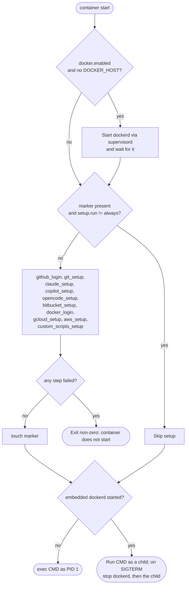
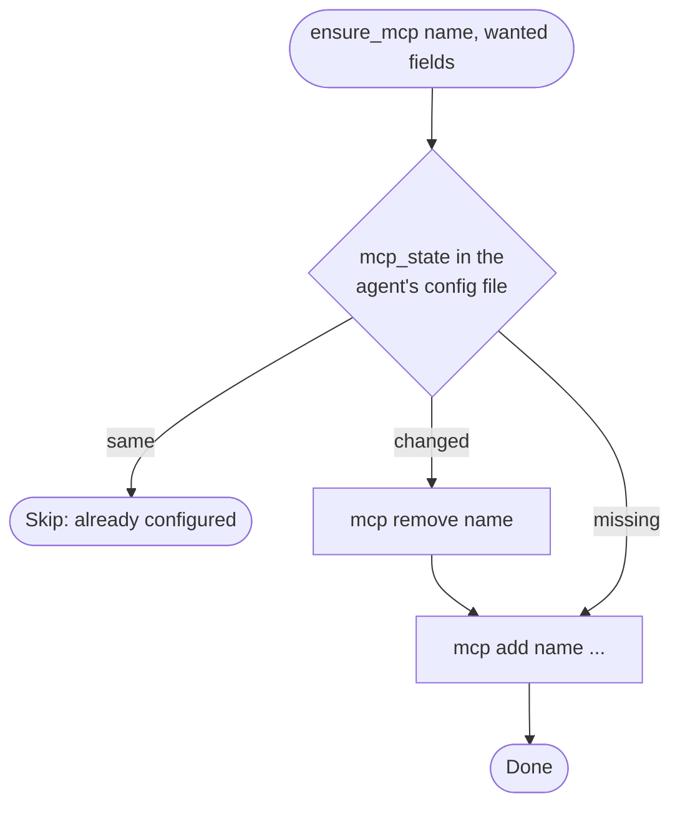
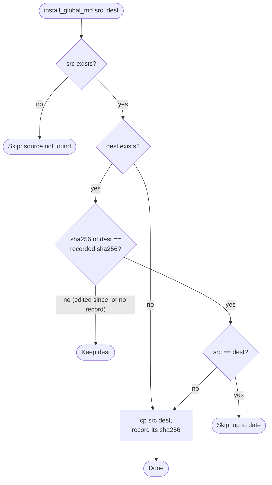

# Flows

## Container start

## Adding an MCP server (ensure_mcp)

Used for Claude (`~/.claude.json`) and Copilot (`~/.copilot/mcp-config.json`), for both HTTP
(`url`) and stdio (`command` + `args`) servers.

## Installing a global instructions file (install_global_md)

Used for Claude's `CLAUDE.md` and opencode's `AGENTS.md`.

