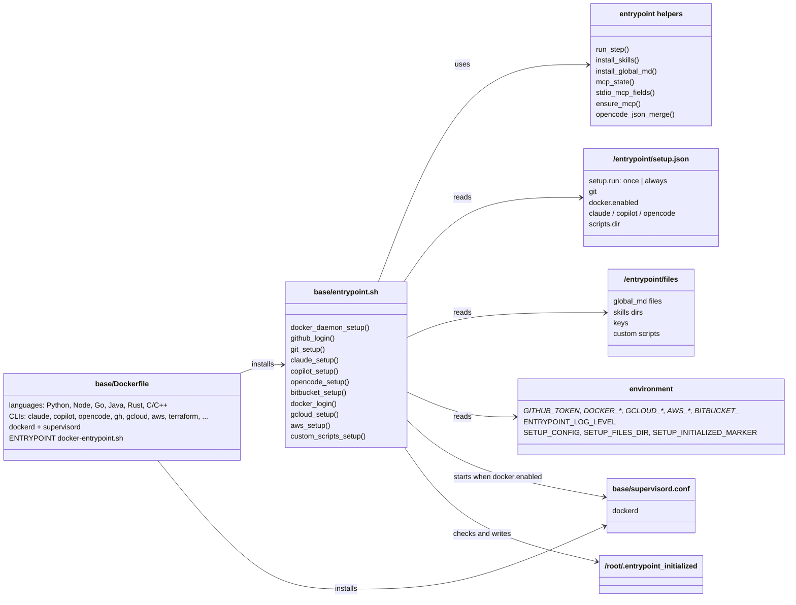

# Architecture

## Image components

```mermaid
classDiagram
    direction LR

    class Dockerfile["base/Dockerfile"] {
        languages: Python, Node, Go, Java, Rust, C/C++
        CLIs: claude, copilot, opencode, gh, gcloud, aws, terraform, ...
        dockerd + supervisord
        ENTRYPOINT docker-entrypoint.sh
    }
    class Entrypoint["base/entrypoint.sh"] {
        docker_daemon_setup()
        github_login()
        git_setup()
        claude_setup()
        copilot_setup()
        opencode_setup()
        bitbucket_setup()
        docker_login()
        gcloud_setup()
        aws_setup()
        custom_scripts_setup()
    }
    class Helpers["entrypoint helpers"] {
        run_step()
        install_skills()
        install_global_md()
        mcp_state()
        stdio_mcp_fields()
        ensure_mcp()
        opencode_json_merge()
    }
    class SetupJson["/entrypoint/setup.json"] {
        setup.run: once | always
        git
        docker.enabled
        claude / copilot / opencode
        scripts.dir
    }
    class Files["/entrypoint/files"] {
        global_md files
        skills dirs
        keys
        custom scripts
    }
    class Env["environment"] {
        GITHUB_TOKEN, DOCKER_*, GCLOUD_*, AWS_*, BITBUCKET_*
        ENTRYPOINT_LOG_LEVEL
        SETUP_CONFIG, SETUP_FILES_DIR, SETUP_INITIALIZED_MARKER
    }
    class Supervisord["base/supervisord.conf"] {
        dockerd
    }
    class Marker["/root/.entrypoint_initialized"]

    Dockerfile --> Entrypoint : installs
    Dockerfile --> Supervisord : installs
    Entrypoint --> Helpers : uses
    Entrypoint --> SetupJson : reads
    Entrypoint --> Files : reads
    Entrypoint --> Env : reads
    Entrypoint --> Supervisord : starts when docker.enabled
    Entrypoint --> Marker : checks and writes
```
